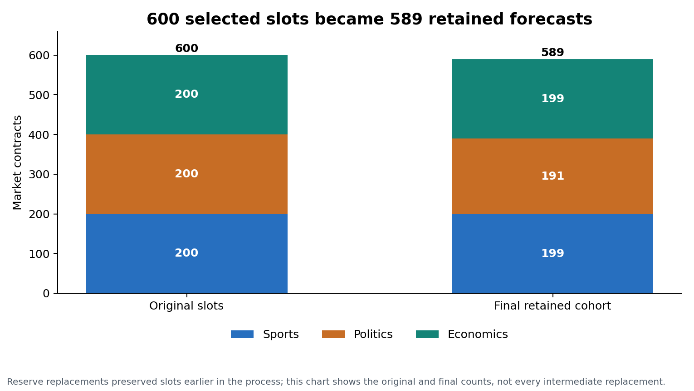
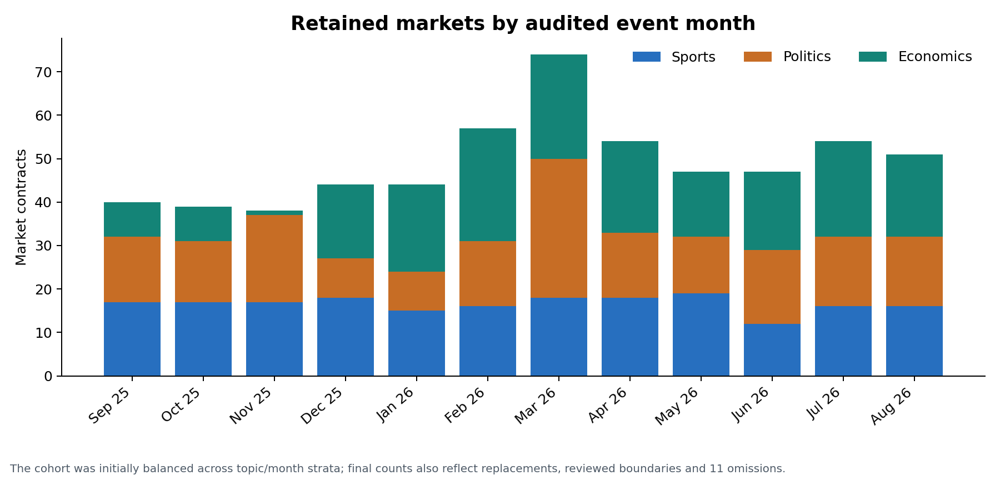
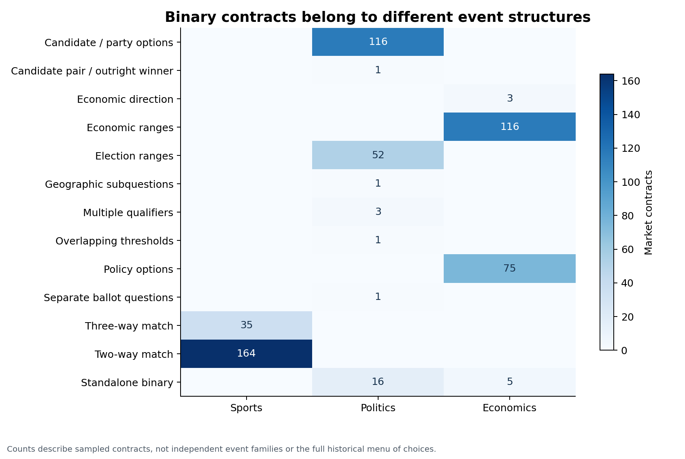
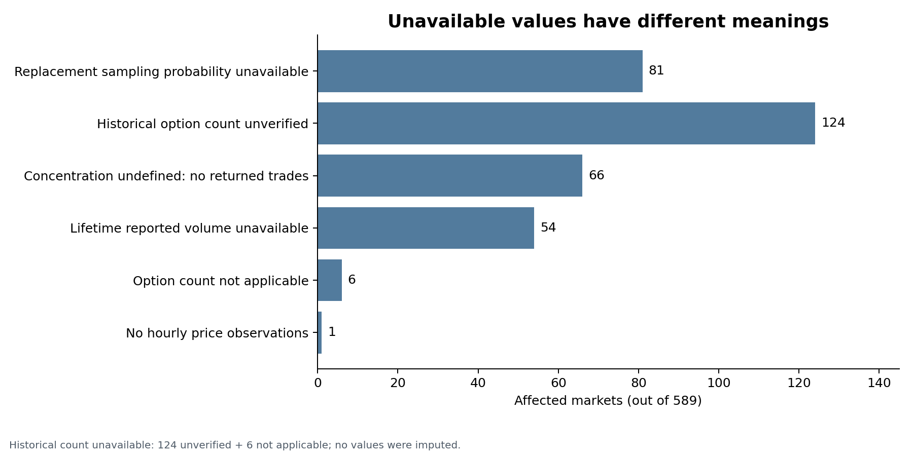
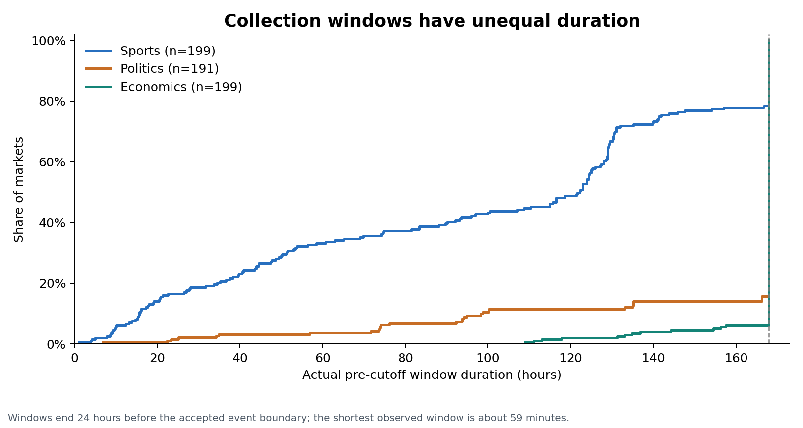
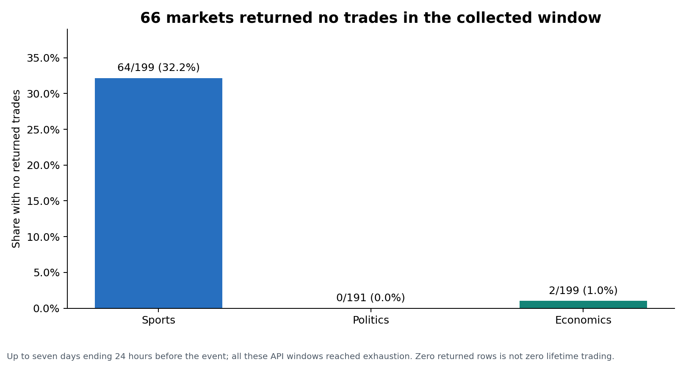
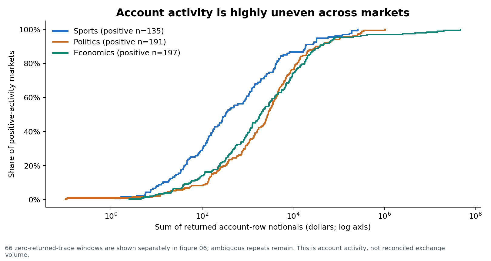
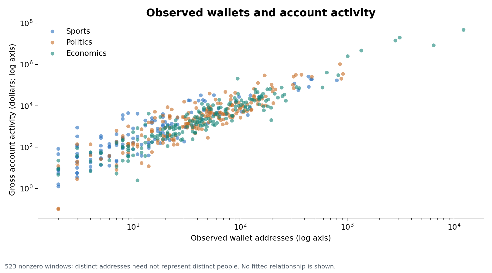
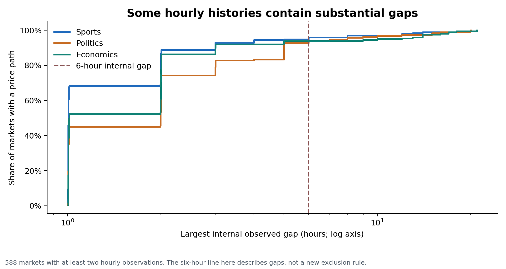
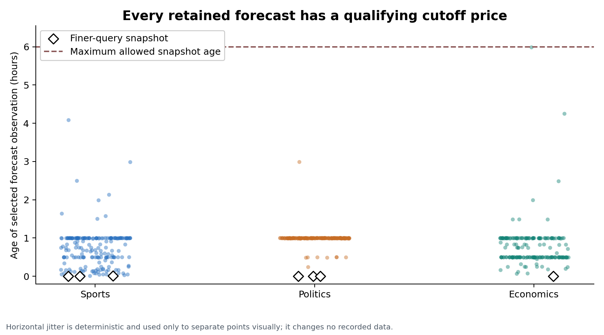

**Draft checkpoint.** The text and figures below retain the earlier 589-contract analysis while revisions are in progress. The updated cohort contains 565 distinct event families: 200 Sports, 200 Politics and 165 Economics. The September 2025-August 2026 study period is unchanged.

## Data sources and study scope

This study examines a sample of 589 trading markets for scheduled sports matches, election outcomes, and economic releases or policy decisions on Polymarket from September 1, 2025 through August 31, 2026.

### Data sources

| **Source** | **Information collected** |
| --- | --- |
| [Gamma API](https://gamma-api.polymarket.com) | Market question, identifiers, tags, event listings, outcome tokens and resolution metadata |
| [Data API](https://data-api.polymarket.com) | Public wallet addresses, BUY/SELL, outcome, price, share size, timestamp and transaction hash |
| [CLOB API](https://clob.polymarket.com) | Historical prices for the selected outcome token |

Request records store the exact URL, retrieval time, response status and content hash to allow the prepared tables to be traced back to their source.

### Data Extraction

The following example request retrieves metadata for market 691922:

```text
GET https://gamma-api.polymarket.com/markets/691922?
```

Trade data was requested for both outcomes in each market using the condition ID (Gamma API).  For each market, the first outcome was selected to request transaction data (Data API).  That outcome’s corresponding token ID was then used to request that outcome’s pricing history (CLOB API).

## Sampling and Market Selection

### Sampling the Market Population

Using Polymarket’s topic tags and the Sports moneyline filter, the initial inventory identified 178,618 distinct markets with scheduled end dates between September 1, 2025 and August 31, 2026.  Prio to sampling, a series of preliminary filters were applied to the market population, including relevant topic tags, binary contracts, a market recorded resolution, and market availability at least 24 hours prior to the listed event timing.  Records were de-duplicated by market ID and event ID to ensure the omission of competing outcomes.  A reproducible random sample of 600 markets—200 per topic—was drawn from the subset.  Sampling was balanced across available months.

### Individual Market Audits

Following the automated checks, the following criteria were reviewed individually for each market.

**Contract Clarification:** Market resolution rules were reviewed rather than reliance on the title or topic tag.  Reviews confirmed inclusion within the topic, the exact outcome, and uncertainty at the time of the proposed market forecast cutoff.  Sports were limited to win/loss contracts, politics were confirmed to be election outcomes, and economics to scheduled release or policy announcements.

**Event Timing:** Polymarket’s closing timestamp did not always align with the date or time the event occurred.  Each market’s boundary was independently verified according to the market type.

- Sports: match or series start

- Politics: final scheduled poll close

- Economics: verified release or policy announcement timing

All times were converted to UTC to account for international events.  The forecast cutoff was set to 24 hours prior to the event’s verified boundary.

**Data Availability:** The market remained open and pricing observations were observed within 6 hours of the forecast cutoff

### Exclusions and reserve replacements

Markets that were excluded following individual audits were replaced using the saved reserve ordering within the same topic and month where possible, followed by the documented nearest-month rule.  Replacement candidates had to pass review before acceptance.  Replacement reasons and attempts remain recorded.

The final evidence reviews covered 105 held cases and supported 94 for inclusion. The remaining 11 were omitted without replacements, leaving 589 contracts: 199 Sports, 191 Politics and 199 Economics. These contracts belong to 496 real-world event families. Evidence availability and the original sampling design limit how broadly the findings can be generalized.

## Forecast windows and prepared tables

### The forecast time

Each forecast is measured 24 hours before the accepted event boundary. The selected price is the latest valid observation at or before that cutoff and no more than six hours old. The six-hour freshness rule limits the age of the observation; it does not move the forecast to six hours before the event.

The trading and price-history window covers up to seven days ending at the forecast cutoff. Later-listed markets have shorter windows. The final 24 hours before the event are outside this history window. There are 198 shortened windows, so observed activity needs to be interpreted alongside the actual duration.

### Collection limits and recovery

When a trade response reaches the 1,000-row request limit, the collector splits the interval and queries smaller windows. It assembles nonoverlapping child windows instead of adding overlapping parent and child responses. The retained histories exhaust the queried API windows; this is a retrieval check, not independent proof of complete blockchain coverage.

Seven selected cutoff forecasts use finer price queries because the hourly history did not supply a qualifying snapshot. All 589 selected prices meet the cutoff and six-hour freshness rules. The finer snapshots remain separate from the hourly price-path table.

### Three prepared tables

| **Table** | **Rows** | **Granularity** |
| --- | --- | --- |
| Markets | 589 | One contract with its forecast, outcome, metadata and descriptive summaries |
| Trades | 296,851 | One returned account-level trading record |
| Price history | 78,576 | One observed price for the first outcome token |

The preparation assigns explicit data types, keeps long identifiers as text, expresses times in UTC, and preserves source file hashes and original row indices. Original trade prices, quantities and timestamps remain unchanged. The tables contain outcome labels and later audit context as well as pre-cutoff measurements, so they are not an automatic model-input matrix.

## Cleaning and data quality

### Repeated trade records

Identical returned trade rows are flagged and retained. One transaction may contain several fills with the same wallet, timestamp, price and size. A follow-up on three selected transactions found that retaining repeated rows preserved directional share balance, whereas collapsing them broke that balance. This supports possible legitimate separate fills; it does not establish the identity of every record.

A separate sensitivity view keeps one occurrence of each exact repeated dictionary. It removes 1,377 occurrences in that hypothetical scenario and may remove legitimate activity. It is not the primary dataset or a corrected fill ledger.

### Zero activity and missing values

Sixty-six markets returned no trades during their collected pre-cutoff windows: 64 Sports and two Economics. They remain in the cohort because observed inactivity is relevant to market behavior and their cutoff forecasts are available. These windows do not establish zero lifetime trading. Counts and observed activity are zero; average trade size and wallet concentration are undefined and remain missing.

Historical alternative counts are reconstructed for 459 contracts, unverified for 124, and not applicable to six nonexclusive groups. All sampled contracts themselves have two outcomes. A binary contract can belong to an event with many candidate choices, so binary contract structure and event alternatives are recorded separately.

### Prices and valid extremes

Thirty-four markets have an internal hourly-series gap longer than six hours. One market has a valid finer cutoff forecast but no hourly price path. Gaps and unavailable path statistics remain explicit. No interpolation, arbitrary outlier deletion, imputation or model-specific normalization is applied; logarithmic plot axes change only the display.

### Activity definitions and verification

Price multiplied by share size gives account-row notional. Its sum is called gross account activity because it has not been reconciled to exchange turnover. Wallet counts identify observed addresses rather than distinct people. BUY and SELL labels alone do not identify liquidity takers and providers.

The saved tables passed 58 data checks, and the project test suite passed 62 tests at this checkpoint. Source comparisons establish table consistency and provenance; they do not independently certify every external event fact or exchange fill.

## Exploratory findings

### Describe what the data reveal

The final cohort is close to balanced across the three topics, but its contracts differ in event structure, observation duration and trading activity. These differences matter when comparing forecasts or using trading records to describe participation.

Activity is highly uneven. The three largest markets contribute 77.09 percent of total gross account activity under the retained-row convention. A small number of large observations therefore has substantial influence on pooled activity summaries.

The 66 windows with no returned trades and the 198 shortened windows show why activity measures require explicit definitions. An inactive window can still provide an eligible price forecast. Missing concentration in an inactive window has a different meaning from a missing historical count of event alternatives.

| **Figure** | **Topic** |
| --- | --- |
| 01 | Sample composition |
| 02 | Audited event months |
| 03 | Underlying event structures |
| 04 | Missingness and its reasons |
| 05 | Window duration |
| 06 | Zero-trade windows |
| 07 | Account activity |
| 08 | Wallet participation and activity |
| 11 | Internal price gaps |
| 12 | Cutoff snapshot freshness |

## Figures

### Figure 01 Sample composition

{fig-alt="Sample composition for the earlier 589-contract cohort."}

### Figure 02 Audited event months

{fig-alt="Audited event months for the earlier 589-contract cohort."}

### Figure 03 Underlying event structures

{fig-alt="Underlying event structures for the earlier 589-contract cohort."}

### Figure 04 Missingness and its reasons

{fig-alt="Missingness and its reasons for the earlier 589-contract cohort."}

### Figure 05 Window duration

{fig-alt="Window duration for the earlier 589-contract cohort."}

### Figure 06 No returned trades in the collected window

{fig-alt="No returned trades in the collected window for the earlier 589-contract cohort."}

### Figure 07 Distribution of account activity

{fig-alt="Distribution of account activity for the earlier 589-contract cohort."}

### Figure 08 Wallet participation and activity

{fig-alt="Wallet participation and activity for the earlier 589-contract cohort."}

### Figure 11 Internal price gaps

{fig-alt="Internal price gaps for the earlier 589-contract cohort."}

### Figure 12 Cutoff snapshot freshness

{fig-alt="Cutoff snapshot freshness for the earlier 589-contract cohort."}
