::: {.eyebrow}
DataPrep_EDA - Capture: 9 September 2026 UTC
:::

The pilot tests whether public Polymarket records can support a study of information aggregation. It combines market metadata, resolved outcome labels, trade records, and one wallet's activity. The saved capture is fixed, so every figure on this page can be reproduced without making new API requests.

<div class="metric-strip">
<div><span class="value">12</span><span class="label">resolved markets</span></div>
<div><span class="value">1,178</span><span class="label">market trade rows</span></div>
<div><span class="value">418</span><span class="label">observed wallet addresses</span></div>
<div><span class="value">188</span><span class="label">joined wallet trade records</span></div>
</div>

::: {.callout-note title="How to read this pilot"}
These are descriptive results from a small, deliberately bounded sample. They establish data availability and reveal collection issues; they do not estimate overall market efficiency or trader skill. All 188 TRADE records in the selected wallet's 200 activity records joined successfully, while the other 12 records describe redemptions, rewards, and a maker rebate.
:::

## Sources and collection

The collector selected three recent resolved markets per Politics, Sports, and Crypto tag, plus one older listing per tag. Discovery required platform-reported volume of at least 1,000. The older-listing filter used a start date at least 45 days before the capture and a scheduled end date within the preceding 30 days or later; actual lifetimes still require inspection because closure can precede the scheduled end.

Each market was limited to two pages of 100 trade records. The selected wallet was the most frequently observed wallet in those sampled rows; its latest 200 activity records were retrieved with a fixed upper time bound. This selection favors recent activity and frequent observed participants.

| Source | What it contributes | Documentation |
|---|---|---|
| Gamma API | Market questions, IDs, tags, outcome tokens, resolution status, reported volume | [Markets](https://docs.polymarket.com/api-reference/markets/list-markets) |
| Data API | Public wallet addresses, BUY/SELL sides, prices, share quantities, and timestamps | [Trades](https://docs.polymarket.com/api-reference/core/get-trades-for-a-user-or-markets) |
| Data API | Trades and other activity for one public proxy wallet | [Wallet activity](https://docs.polymarket.com/api-reference/core/get-user-activity) |
| CLOB API | Historical prices for an outcome token | [Price history](https://docs.polymarket.com/api-reference/markets/get-prices-history) |

A concrete metadata request used in this workflow is:

```text
https://gamma-api.polymarket.com/markets?tag_id=2&closed=true&uma_resolution_status=resolved&volume_num_min=1000&limit=3&order=id&ascending=false&include_tag=true
```

A trade-history request identifies a market by its condition ID:

```text
https://data-api.polymarket.com/trades?market=0x1d8f9398b0412678865cfc50aea7d49025b35e54a8a4fe1a223db45447e4138a&takerOnly=false&limit=100&offset=0
```

The [request manifest](downloads/raw-manifest.json) records the exact captured URLs, times, HTTP status codes, and response hashes. [Collection code](downloads/code/prove_data.py) and [the full raw capture](downloads/raw-sample.zip) are available for inspection.

## Raw records to analytical tables

Market records join to trades through `conditionId`. Outcome token IDs and their ordered outcome labels provide a second consistency check. Gamma metadata must be fetched for both open and closed markets when joining wallet activity; querying only open markets initially omitted 65 wallet trade records.

The cleaner validates wallet addresses, condition and token joins, outcome labels, BUY/SELL sides, positive quantities, prices between zero and one, and timestamps no later than the capture cutoff. Resolved labels require an explicit resolved status and a unique 0/1 outcome-price vector. The reviewed run has no rejected trade rows.

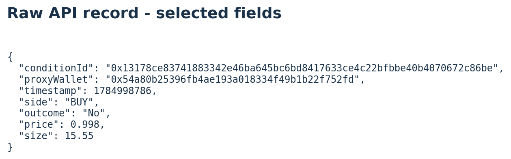{fig-alt="Selected raw JSON fields showing a condition ID, wallet address, timestamp, trade side, outcome, price, and share size."}

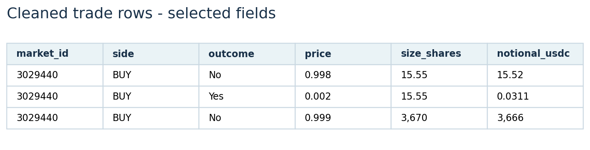{fig-alt="Three cleaned trade rows showing market ID, side, outcome, price, share size, and computed notional."}

Category labels use exact recognized tag slugs; overlapping domains remain combined. All 12 top-level category fields are absent, but their tags allow provisional classification. Five exact duplicate market-row candidates are retained because the response lacks a unique fill identifier, so identical observed rows cannot safely distinguish duplicate delivery from separate fills.

Missing values stay missing with an explicit reason. Wallet profit, win rate, and ROI remain unestimated because the bounded sample does not reconstruct full positions or cash flows. Valid extreme trade sizes are retained. [Cleaning code](downloads/code/clean_data.py) and [field definitions](downloads/data_dictionary.md) document the transformations.

## Explore the pilot

Figures use only the reviewed capture. Market IDs can be matched to the questions in the market register below. All figure-generation code is available in [prepare_website.py](downloads/code/prepare_website.py).

### 01 - Market categories

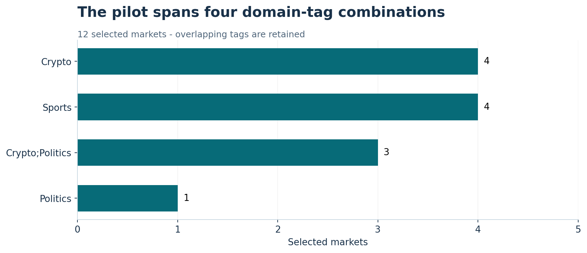{fig-alt="Horizontal bars showing four Sports, four Crypto, three Crypto and Politics, and one Politics market."}

### 02 - Market duration

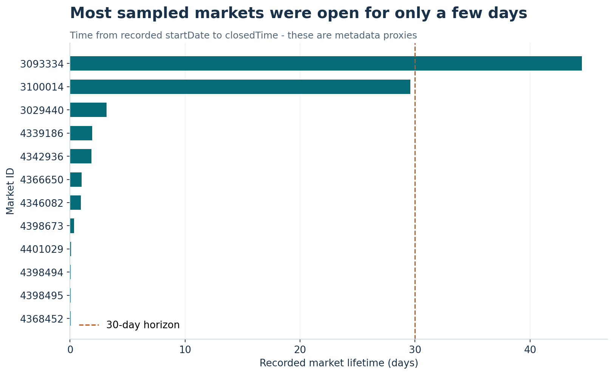{fig-alt="Market lifetimes in days with a reference line at 30 days."}

### 03 - Reported trading volume

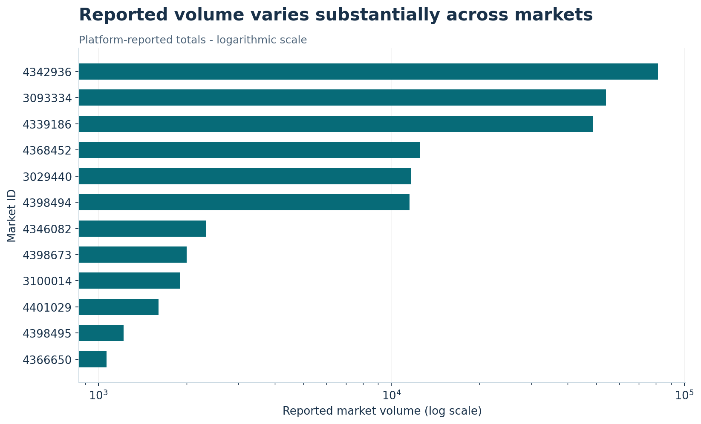{fig-alt="Horizontal bar chart of platform-reported volume for each market on a logarithmic scale."}

### 04 - Trade-history coverage

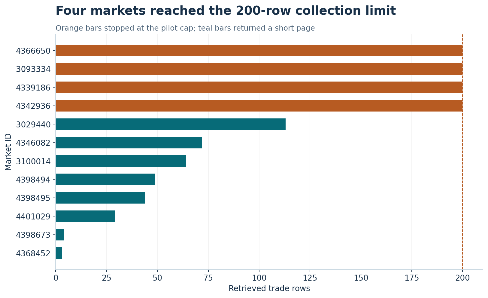{fig-alt="Trade-row counts by market, with four markets marked at the 200-row collection cap."}

### 05 - Observed participation

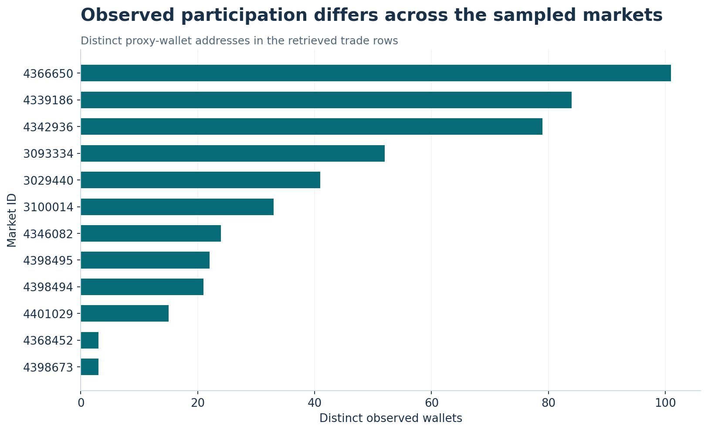{fig-alt="Horizontal bars comparing distinct observed wallet addresses for the twelve sampled markets."}

### 06 - Trading concentration

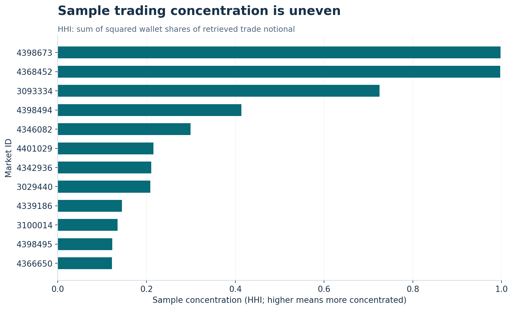{fig-alt="Sample wallet-notional concentration for each market on a zero-to-one HHI scale."}

### 07 - Historical price availability

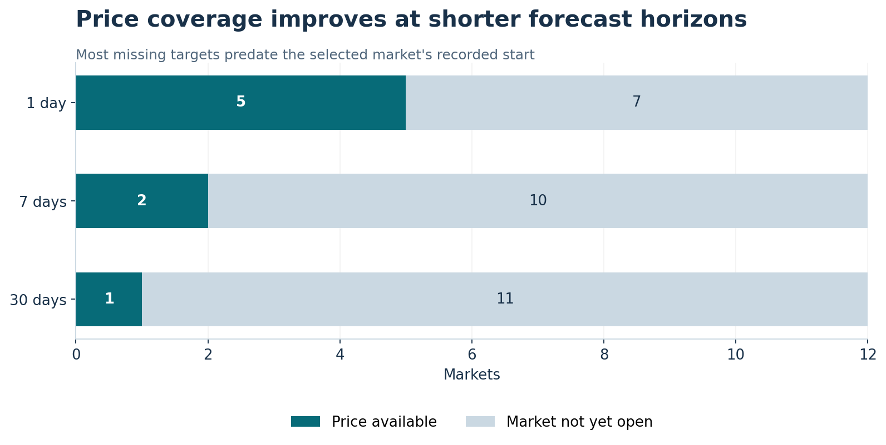{fig-alt="Stacked bars show available prices for one, two, and five of twelve markets at the 30-day, seven-day, and one-day horizons."}

### 08 - Trade-size distribution

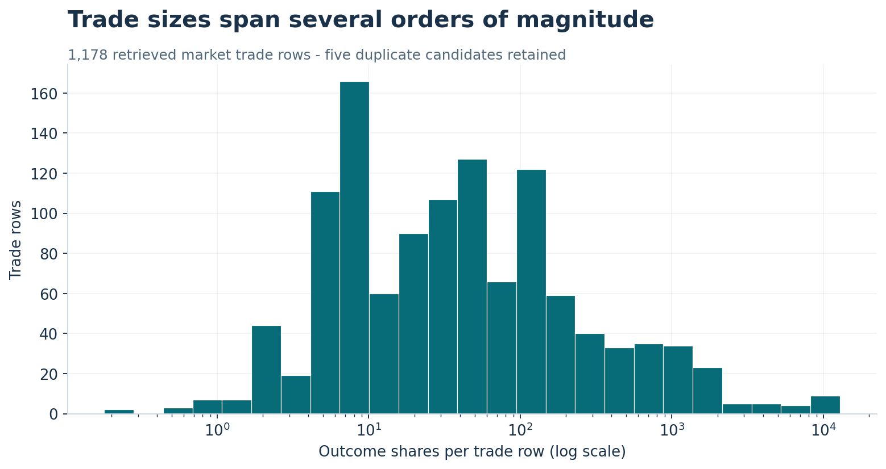{fig-alt="Histogram of outcome-share quantities across 1,178 retrieved trade rows on a logarithmic horizontal scale."}

### 09 - Trade-price distribution

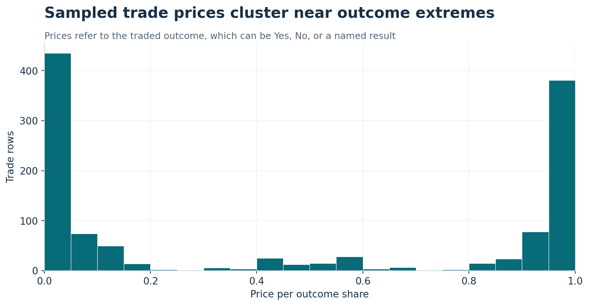{fig-alt="Histogram of sampled trade prices between zero and one, pooled across traded outcome tokens."}

### 10 - One wallet across domains

{fig-alt="Nine domain-tag combinations for one wallet, led by 111 Politics, 36 Sports, and 30 Crypto trade records."}


## What these checks change

- **Historical coverage:** Four markets and the selected wallet hit the collection cap. More complete collection and independent coverage checks are needed before interpreting lifetime participation or performance.
- **Forecast horizons:** Most sampled markets are too short-lived for a 30-day comparison. A longer-running cohort must be selected deliberately.
- **Price timing:** Six-hour requests around the chosen historical targets succeeded after a larger 32-day request failed. Prices are taken only at or before each target and at most six hours earlier; timestamp and age remain in the table.
- **Event timing:** Scheduled end dates and closure times can differ. A defensible information cutoff needs review before forecast evaluation.
- **Domain definitions:** Multiple tags and unclassified subjects require a reviewed taxonomy before cross-domain skill comparisons.

## Market register

| Market ID | Question | Domain tags | Resolved label |
|---|---|---|---|
| 4346082 | Will Mike Winkelmann (Beeple) post about $LAPTOP by September 30? | Crypto + Politics | Yes |
| 4342936 | LAPTOP airdrop by September 9? | Crypto + Politics | Yes |
| 4339186 | LAPTOP airdrop by September 30? | Crypto + Politics | Yes |
| 3093334 | Will AfD win 50 or more seats in the 2026 Sachsen-Anhalt parliamentary elections? | Politics | No |
| 4401029 | Map Handicap: MIBR (-1.5) vs 9z (+1.5) | Sports | MIBR |
| 4398495 | Texas Rangers vs. Seattle Mariners: O/U 14.5 | Sports | Over |
| 4398494 | Spread: Texas Rangers (-6.5) | Sports | Seattle Mariners |
| 3100014 | Will there be a red flag during the 2026 F1 Dutch Grand Prix? | Sports | Yes |
| 4398673 | Will Ethereum reach $2,500 on September 9? | Crypto | Yes |
| 4368452 | Will Ethereum reach $2,500 in September? | Crypto | Yes |
| 4366650 | Bitcoin Up or Down - September 9, 11:20AM-11:25AM ET | Crypto | Down |
| 3029440 | Over $37.5M committed to the RipCars public sale? | Crypto | No |

## Data and code

All linked tables refer to capture `20260909T153138473505Z`. Public raw API responses include wallet addresses and profile fields; the cleaned analytical tables omit profile names, biographies, and images.

| Artifact | Download |
|---|---|
| Exact raw responses and collection metadata | [Raw sample ZIP](downloads/raw-sample.zip) / [Manifest JSON](downloads/raw-manifest.json) |
| One row per market | [markets.csv](downloads/clean/markets.csv) |
| Retrieved market trade rows | [trades.csv](downloads/clean/trades.csv) |
| Selected wallet's joined trades | [wallet_trades.csv](downloads/clean/wallet_trades.csv) |
| One row per wallet by domain-tag combination | [wallet_category.csv](downloads/clean/wallet_category.csv) |
| Validation counts and missingness | [quality_report.json](downloads/clean/quality_report.json) |
| Reproducible collector, cleaner, figure scripts, and tests | [Source code ZIP](downloads/source-code.zip) |
| Executed data inspection notebook | [01_data_exploration.ipynb](downloads/01_data_exploration.ipynb) |
| Field definitions and assumptions | [Data dictionary](downloads/data_dictionary.md) |

A complementary source, a larger research sample, and the later course analyses remain to be developed. [Current conclusions](Conclusions.qmd) distinguish the established data joins from the research questions still open.
