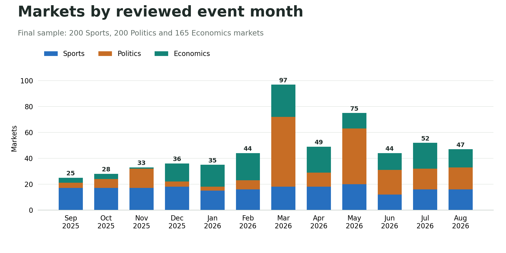
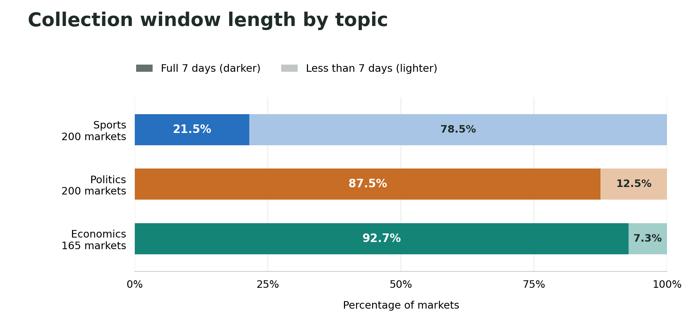
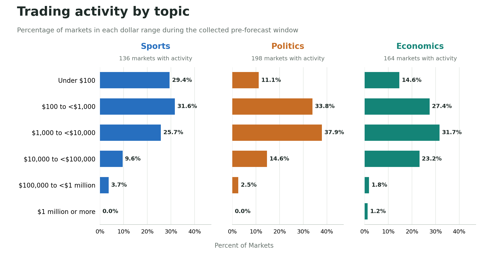
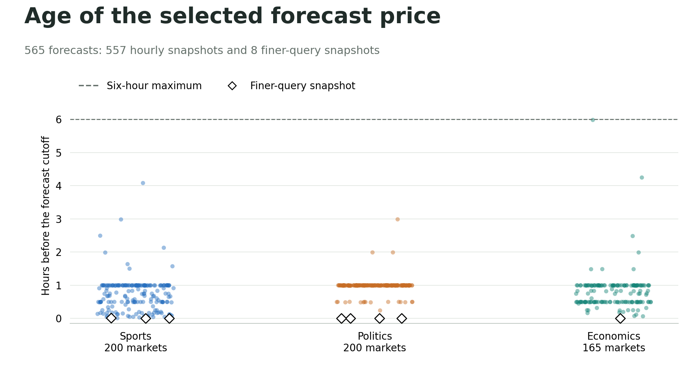

## Data Sources & Scope

This study examines a sample of 565 trading markets for scheduled sports matches, election outcomes, and economic releases or policy decisions on Polymarket from September 1, 2025 through August 31, 2026.

### Data Sources

| **Source** | **Information collected** |
| --- | --- |
| [Gamma API](https://gamma-api.polymarket.com) | Market question, identifiers, tags, event listings, outcome tokens and resolution metadata |
| [Data API](https://data-api.polymarket.com) | Public wallet addresses, BUY/SELL, outcome, price, share size, timestamp and transaction hash |
| [CLOB API](https://clob.polymarket.com) | Historical prices for the selected outcome token |

Table 1: API sources, links, and information included in each

Request records store the exact URL, retrieval time, response status and content hash to allow the prepared tables to be traced back to their source.

### Data Extraction

The following example request retrieves metadata for market 691922:

```text
GET https://gamma-api.polymarket.com/markets/691922?
```

Market condition IDs and outcome-token IDs were obtained from the Gamma API.  Trades for both outcomes were requested from the Data API using each market's condition ID.  CLOB price history was requested using the first outcome's token ID.  When responses exceeded the configured 1,000-row limit, requests intervals were split into smaller, non-overlapping windows.

::: {.section-references}
Linked References: [API Requests](downloads/current/api-requests-and-code.zip "ZIP: current collection code and request index for the current cohort"), [Raw Market Metadata](downloads/current/raw-market-metadata.zip "ZIP: saved Gamma metadata for the 565 current markets"), [Raw Transaction Data](downloads/current/raw-transactions.zip "ZIP: current retained trade windows in original API fields; 155,177 rows"), [Raw Pricing Data](downloads/current/raw-prices.zip "ZIP: current hourly windows and eight separate finer cutoff responses")
:::

### Forecast Time & Trading Window

Trade and price-history requests covered up to seven days, ending 24 hours before each market’s reviewed event boundary (Table 2).  This historical trading window and cutoff boundary were employed to compare across a consistent lead time and avoid prices that already reflect a known outcome.  For 194 markets, the available history was shorter as markets were listed less than seven days before the cutoff (Figure 6).  The forecast price was identified as the latest price at or no more than 6 hours before the cutoff.  If no price history was available in the configured hourly observations, one-minute requests were made for that same six-hour period (Figure 10).

## Sampling and Market Selection

### Sampling the Market Population

Using Polymarket’s topic tags and the Sports “moneyline” filter, the initial inventory identified 178,618 distinct markets with scheduled end dates between September 1, 2025 and August 31, 2026.  Prior to sampling, a series of preliminary filters were applied to the market population, excluding irrelevant topic tags, non-binary contracts, and markets without a recorded resolution or availability at least 24 hours prior to the listed event timing.  Repeated listings of the same market were consolidated using its unique market ID to ensure each contract appeared only once.  A random sample of 600 markets—200 per topic—was drawn from the subset.  Initial sampling was balanced throughout the available months.

::: {.section-references}
Linked References: [Sampling Code](downloads/current/sampling-code.zip "ZIP: current sampling and family replacement source code")
:::

### Individual Market Evidence Reviews

Following the automated checks, each contract was reviewed individually for each market.

**Contract Clarification:** Market resolution rules were reviewed rather than relying on the title or topic tag.  Reviews confirmed the topic, the exact outcome, and uncertainty at the time of the proposed market forecast cutoff.  Contracts were also reviewed to identify those involving the same real-world event.  Sports were limited to match/series outcome contracts, politics were confirmed to be election outcomes, and economics to scheduled release or policy announcements.

**Event Timing:** This study focused on scheduled events so forecasts could be compared at a consistent time before each event.  Polymarket’s closing timestamp did not always match the relevant real-world event boundary, so market rules and supporting sources were reviewed to establish the boundaries in Table 2.

| **Topic** | **Event Boundary** |
| --- | --- |
| Sports | Match or series start time |
| Politics | Final scheduled poll close time |
| Economics | Verified release or policy announcement timing |

Table 2: Defined market boundaries by topic

All times were converted to UTC to account for international events.  The forecast cutoff was reset to 24 hours prior to the event’s verified boundary.

**Data Availability**: The market remained open and pricing observations were observed within 6 hours of the forecast cutoff.

All replacement rationale and attempts were recorded in a candidate ledger.  Exclusion examples and rationale for each topic are listed below.

| **Topic** | **Market** **(ID)** | **Reason for Exclusion** |
| --- | --- | --- |
| Sports | Reds vs Dodgers (580661) | The listed end date on this was September, but the game occurred on August 26, before the study window. |
| Politics | Will Anamaria Gavrilă win the Romanian presidential election? (519081) | The candidate withdrew before the proposed forecast cutoff. The election also occurred in May 2025, outside the study window. |
| Economics | Will a dozen eggs cost between $4.00–4.25 in October? (654410) | The specified October 2025 egg-price observation was not published. |

Table 3: Examples of excluded markets with rationale

::: {.section-references}
Linked References: [Candidate Ledger](downloads/current/candidate-ledger-completed-20260916.csv "CSV: latest completed replacement round, including final acceptances and recorded skips")
:::

### Market Exclusions & Reserve Replacements {#exclusions-and-reserve-replacements}

Individual market evidence reviews resulted in 94 sample exclusions.  Excluded markets following individual audits were replaced using the established random reserve ordering within the same topic and month, where possible.  If no eligible candidates remained in that month, candidates were drawn from the nearest available month within the study period.  Replacement candidates passed evidence reviews before acceptance.  Exclusion rationale and replacement attempts remain recorded.

Reserve markets from the initial distinct market population backfilled excluded Sports and Politics samples to the stated goal of 200 contracts.  Eligibility requirements yielded only 165 Economics observations within September 2025–August 2026.  No additional qualifying event families remained in the reserve pool.

The final evidence reviews left 565 contracts in the cohort: 200 Sports, 200 Politics and 165 Economics, each with distinct real-world event families (Figure 1).  The automated and individual exclusions introduce bias towards scheduled event markets and markets with more easily verifiable outcomes.  Replacements drawn from other months contributed to an uneven monthly distribution of Politics and Economics markets in the final sample (Figure 2).

## Cleaning & Data Quality Checks

### Repeat Trade Records

Identical returned trade rows were flagged but retained in the dataset.  One transaction may be completed via several fills with the same wallet, timestamp, price and size.  In three examined transactions, retaining repeated rows preserved BUY vs SELL transaction consistency, supporting their retention.

::: {.section-references}
Linked References: [Repeat Test Code](downloads/current/trade-record-check-code.zip "ZIP: current full-cohort trade-direction and repeated-row diagnostic code")
:::

### Empty Transaction Histories

67 markets returned no trades in their collected pre-cutoff windows: 64 Sports, two Politics and one Economics (Figure 3).  Each was retained as lack of recent activity is relevant to market behavior.  As a result, however, average trade size and wallet concentration are undefined and therefore not included in these 67 markets.

### Varying Outcome Alternatives

Every sampled contract had two outcomes (typically *Yes* and *No*).  Many contracts represented one of several bets on the same event family—for example, separate Yes/No contacts on which candidate would win an election.  Some contracts belonged to groups of overlapping questions (for instance, questions asking whether the Conservative Party would win at least 300 seats or at least 400 seats could both resolve Yes).  The number of possible outcomes for each underlying event was recorded where available to provide context when comparing forecasts (Figure 4).

### Activity Definitions

Trading activity was measured as the summation of price multiplied by share size.  These totals measure account-level activity and include both BUY and SELL side volume.  Unique wallet counts represent distinct addresses and serve as a proxy for individual traders; however, one person may control multiple wallets.

### General EDA and Prepared Tables

Standardization steps include:

- Market and token IDs stored as text to preserve exact values

- Wallet addresses and transaction hashes formatted in lowercase

- Column names unified across the prepared tables

- Timestamps converted to UTC

Inconsistent outcome labels were mapped to consistent names using outcome token identifiers, preserving original labels.  Repeated trade rows were flagged but retained.  Additional columns explain missing values, including average trade size and wallet concentration when no trades were returned, and the number of event alternatives when that count could not be established.

| **Table** | **Rows** | **Granularity** |
| --- | --- | --- |
| Markets | 565 | One contract with its forecast, outcome, metadata and descriptive summaries |
| Trades | 155,177 | One returned account-level trading record |
| Price history | 75,061 | One observed price for the first outcome token |

Table 4: Descriptions of the three tables prepared following extraction and cleaning

The tables include trading and price measurements from the up-to-seven-day window ending at the forecast cutoff, along with final outcomes and audit information.

::: {.section-references}
Linked References: [Cleaned Market Table](downloads/current/cleaned-markets.csv "CSV: 565 current market rows"), [Cleaned Trades Table](downloads/current/cleaned-trades.zip "ZIP: current trades CSV and field definitions; 155,177 rows"), [Cleaned Price History Table](downloads/current/cleaned-price-history.zip "ZIP: current price-history CSV and field definitions; 75,061 rows"), [Data Prep/Cleaning Code](downloads/current/cleaning-code.zip "ZIP: current table preparation and validation source code with field definitions")
:::

### Before and After Data Snapshots

[Outcome label unification example](assets/cleaning-snapshots/01_trade_fields_before_after.png) (trades table)

[Repeat row flag](assets/cleaning-snapshots/02_repeated_row_flags.png) (trades table)

[Empty trade history flags](assets/cleaning-snapshots/03_empty_history_flags.png) (markets table)

## Exploratory Visualizations

### Figure 01 Market pool, replacements and final cohort

{fig-alt="Market selection by topic. Sports: pool 144785, initial 200, replacements needed 2, filled 2, final 200. Politics: pool 30938, initial 200, replacements needed 111, filled 111, final 200. Economics: pool 3966, initial 200, replacements needed 71, filled 36, unfilled 35, final 165."}

### Figure 02 Audited event months

{fig-alt="Stacked monthly counts for the final 565 markets, September 2025 through August 2026. Topic totals are Sports 200, Politics 200 and Economics 165. March 2026 has the largest total, 97 markets."}

### Figure 03 No returned trades in the collected window

{fig-alt="Bar chart of zero-returned-trade windows in the final sample. Sports 64 of 200, 32.0%; Politics 2 of 200, 1.0%; Economics 1 of 165, 0.6%. Total 67 of 565."}

### Figure 04 Number of event options

{fig-alt="Heatmap of underlying event options. Sports: 165 two options, 35 three or more, zero unverified or overlapping. Politics: 2 two options, 17 three or more, 177 count not verified, 4 overlapping. Economics: 1 two options, 163 three or more, 1 count not verified, zero overlapping."}

### Figure 05 Very large trade records

{fig-alt="Dot plot of 113 transactions containing records above about $20,540. April Fed no-change: 92; July Fed 25-basis-point cut: 15; September ECB increase: 2; Arsenal, Beaudoin, McKinney and February ECB no-change: 1 each. Maximum record is $2.994 million."}

### Figure 06 Collection window length by topic

{fig-alt="Three 100-percent stacked bars compare full seven-day and shorter collection windows. Sports: 21.5% full and 78.5% shorter. Politics: 87.5% full and 12.5% shorter. Economics: 92.7% full and 7.3% shorter."}

### Figure 07 Trading activity by topic

{fig-alt="Three aligned bar charts show the share of markets in six dollar ranges by topic. 61% of Sports markets with activity fall below $1000, compared with 45% of Politics and 42% of Economics. Denominators are 136 Sports, 198 Politics and 164 Economics markets; zero-activity windows are omitted."}

### Figure 08 Distinct wallets per market

{fig-alt="Density curves for distinct wallet counts per market, with a logarithmic x-axis. Includes 136 Sports, 198 Politics and 164 Economics markets with observed wallets. Median counts among these markets are 13, 33 and 42 respectively. Zero-wallet windows are omitted."}

### Figure 09 Wallets shared across topics

{fig-alt="Horizontal bars showing wallets also seen in another topic: Sports 291 of 5009 (5.8%), Politics 1409 of 7536 (18.7%), Economics 1368 of 11337 (12.1%). Overall 1477 of 22291 unique addresses appear in multiple topics (6.6%)."}

### Figure 10 Cutoff snapshot freshness

{fig-alt="Topic-colored points show forecast-price ages for 200 Sports, 200 Politics and 165 Economics markets. Every observation is between 9 seconds and 5 hours 59 minutes 1 second before cutoff. Eight finer-query snapshots are marked with diamonds, and a dashed line marks the six-hour maximum."}

::: {.section-references}
Linked References: [EDA Visualization Notebook](downloads/current/eda-visualization-notebook.ipynb "Jupyter notebook: current executed EDA; uses project Parquet tables and supporting files") | [Notebook + Data (ZIP)](downloads/current/eda-notebook-and-data.zip "ZIP: current notebook, all required data, supporting evidence, code and run instructions")
:::
