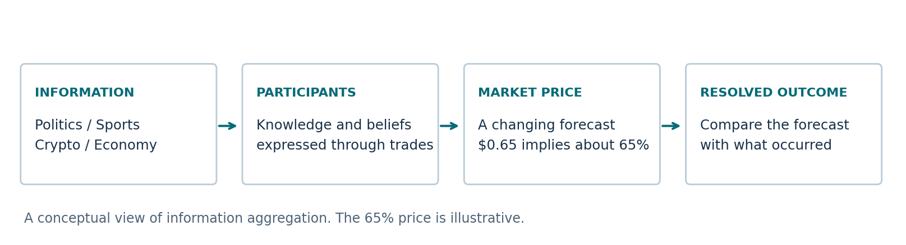

::: {.eyebrow}
Introduction - Prediction markets
:::

Prediction markets turn disagreement about future events into prices that can be followed over time. Participants buy and sell contracts tied to outcomes such as an election result, a sporting event, or an economic announcement. In a standard binary contract, a winning share pays one dollar and a losing share pays zero. A price of 65 cents is commonly read as an implied probability of about 65 percent, although that price is not a guarantee or a verified measure of the event's true likelihood. Polymarket brings these markets together across a wide range of subjects. Its prices emerge from participants' orders, and its written resolution rules determine how outcomes are settled. The appeal is a public forecast that can change as information arrives. Understanding when that forecast deserves confidence matters to people who use market probabilities to interpret uncertain events. [Polymarket's explanation of prices](https://docs.polymarket.com/concepts/prices-orderbook) and [resolution rules](https://docs.polymarket.com/concepts/resolution) describe the underlying mechanism.

The promise of prediction markets depends on how effectively dispersed information reaches the market price. Research by Justin Wolfers and Eric Zitzewitz found that market forecasts were often accurate across the settings they reviewed and frequently outperformed comparison forecasts, while also examining limitations in market design. That evidence motivates a closer look at the conditions under which aggregation works. A market with many participants may bring together varied knowledge, but a large crowd does not automatically imply independent information. A heavily traded market may make it easier to act on new evidence, while activity concentrated in a few wallets raises a different set of questions. Expertise may also be tied to a particular subject: knowledge that helps interpret a political development may not transfer to sports or cryptocurrency. The distinction between broad forecasting ability and domain-specific knowledge is therefore central to understanding who contributes useful information. These questions concern the reliability of public forecasts and the circumstances that make them informative. [Wolfers & Zitzewitz, *Prediction Markets* (2004)](https://www.nber.org/papers/w10504).

{#fig-information-flow fig-alt="Diagram showing domain information flowing to participants, then a market price, with the later resolved outcome used for evaluation."}

::: {.research-question}
**Is forecasting skill general, or is it domain-specific?**
:::

## Research questions

These ten questions define the initial research direction. Their scope will be refined as historical coverage and category definitions are established.

::: {.question-list}
1. How closely do market probabilities correspond to the frequencies of eventual outcomes?
2. Does the accuracy of those probabilities differ across subject areas?
3. Are markets with greater liquidity more informative about future outcomes?
4. Does participation by more traders improve the quality of a market's forecast?
5. How does concentration of trading among a few wallets relate to forecast quality?
6. How quickly do market prices respond to identifiable public information?
7. Do traders who specialize in a subject make more informative forecasts within that subject?
8. Does forecasting performance in one domain carry over to other domains?
9. Do trade sizes, trade direction, or participant histories add information beyond the current market probability?
10. How do forecast quality and trading activity change as an event approaches?
:::

## The evidence so far

A small public-data pilot has established that market metadata, resolved outcome labels, trade records, and one wallet's activity can be joined. It has also identified gaps that require further collection and review. [Data preparation and exploratory analysis](DataPrep_EDA.qmd) describes the sample, its sources, and the limits of the current evidence.
